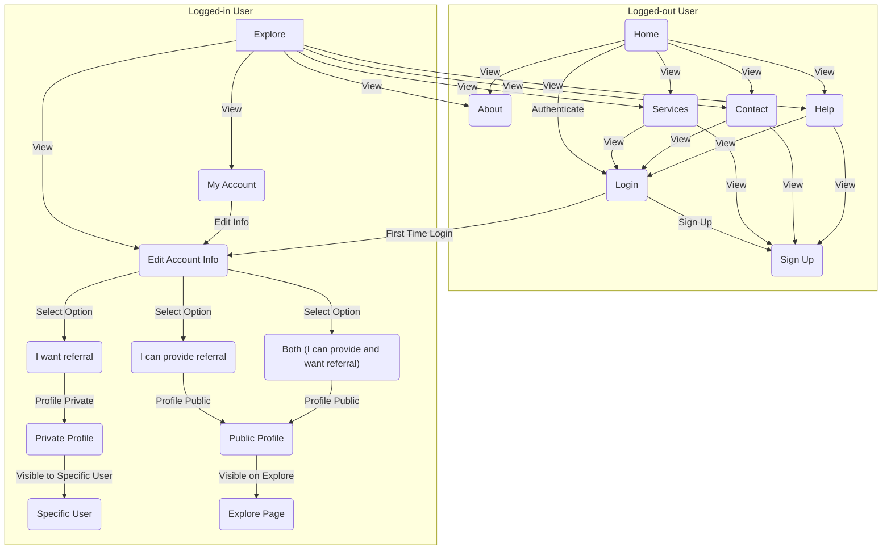

```mermaid
flowchart TD
  subgraph Logged-out User
    direction LR
    Home(Home) -- View --> About(About)
    Home -- View --> Services(Services)
    Home -- View --> Contact(Contact)
    Home -- View --> Help(Help)
    Home -- Authenticate --> Login(Login)
    Login -- Sign Up --> SignUp(Sign Up)
    Services -- View --> Login
    Services -- View --> SignUp
    Contact -- View --> Login
    Contact -- View --> SignUp
    Help -- View --> Login
    Help -- View --> SignUp
  end

  subgraph Logged-in User
    direction LR
    Login -- First Time Login --> EditAccount(Edit Account Info)

    Explore -- View --> About
    Explore -- View --> Services
    Explore -- View --> Contact
    Explore -- View --> Help
    Explore -- View --> MyAccount(My Account)
    Explore -- View --> EditAccount

    MyAccount -- Edit Info --> EditAccount

    EditAccount -- Select Option --> Option1("I want referral")
    EditAccount -- Select Option --> Option2("I can provide referral")
    EditAccount -- Select Option --> Option3("Both (I can provide and want referral)")

    Option1 -- Profile Private --> PrivateProfile(Private Profile)
    PrivateProfile -- Visible to Specific User --> SpecificUser(Specific User)

    Option2 -- Profile Public --> PublicProfile(Public Profile)
    PublicProfile -- Visible on Explore --> ExplorePage(Explore Page)

    Option3 -- Profile Public --> PublicProfile
  end


```
