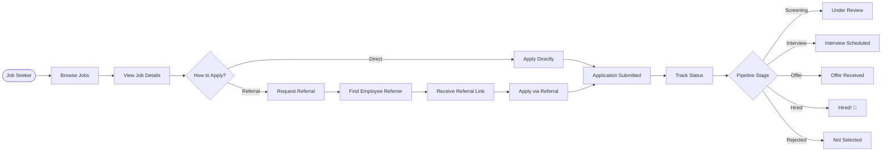
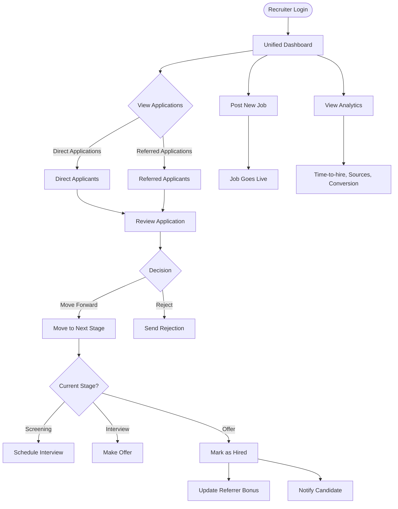
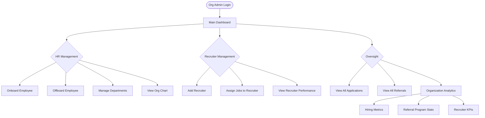
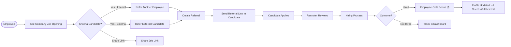
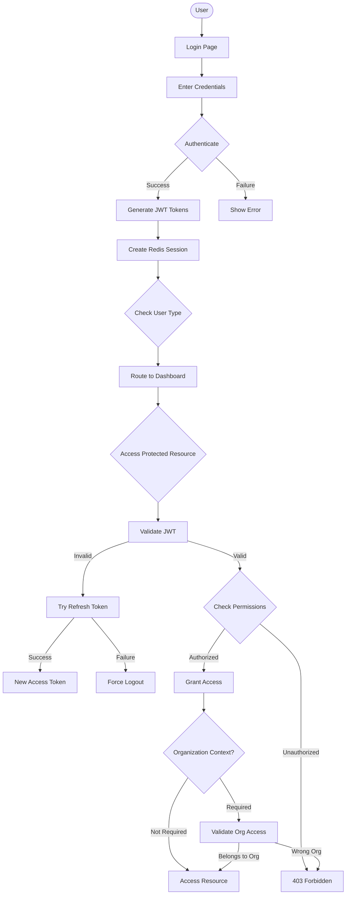
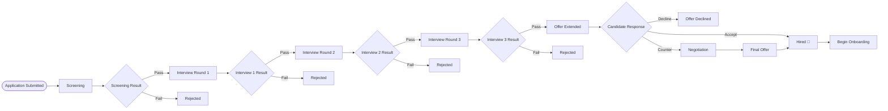
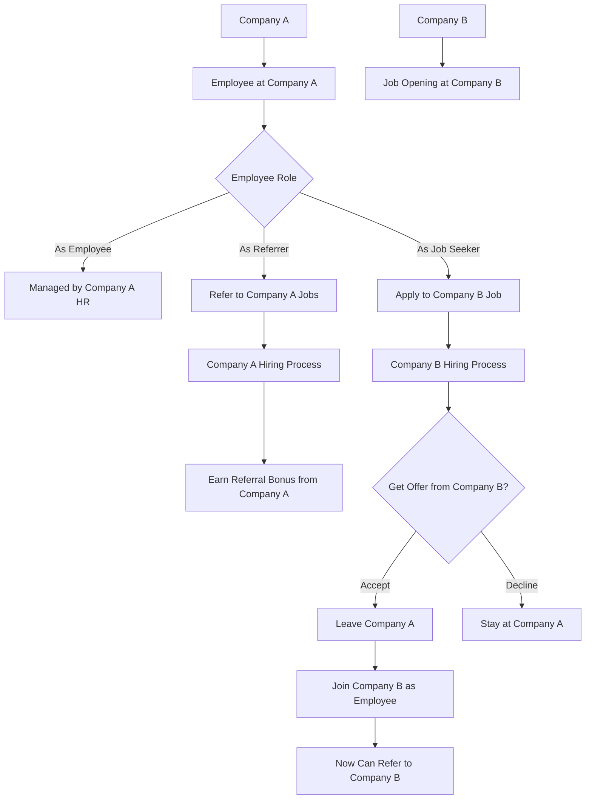

# ReferralNetworkHub - User Flow Diagrams

## Multi-Tenant Platform Flow

This document visualizes user flows for the **ReferralNetworkHub** multi-tenant platform.

---

## 🎯 Platform-Level Flow

```mermaid
flowchart TD
    Start([Platform Entry]) --> Public{User Type?}

    Public -->|Not Logged In| PublicPages[Public Pages]
    PublicPages --> BrowseJobs[Browse Jobs]
    PublicPages --> ViewOrgs[View Organizations]
    PublicPages --> Login[Login/Signup]

    Public -->|Logged In| AuthCheck{Authenticate}
    AuthCheck --> RoleCheck{User Role?}

    RoleCheck -->|PLATFORM_SUPER_ADMIN| SuperAdminDash[Super Admin Dashboard]
    SuperAdminDash --> ManageSystem[System Configuration]
    SuperAdminDash --> ManageAdmins[Manage Platform Admins]
    SuperAdminDash --> ManageOrgs[Manage Organizations]

    RoleCheck -->|PLATFORM_ADMIN| PlatformAdminDash[Platform Admin Dashboard]
    PlatformAdminDash --> ManageAllOrgs[Manage All Organizations]
    PlatformAdminDash --> PlatformAnalytics[Platform Analytics]
    PlatformAdminDash --> CustomerSupport[Customer Support]

    RoleCheck -->|ORGANIZATION_ADMIN| OrgAdminDash[Organization Admin Dashboard]
    OrgAdminDash --> ManageEmployees[Manage Employees]
    OrgAdminDash --> ManageRecruiters[Manage Recruiters]
    OrgAdminDash --> OrgStructure[Organization Structure]
    OrgAdminDash --> HRWorkflows[HR Workflows]

    RoleCheck -->|ORG_RECRUITER| RecruiterDash[Recruiter Dashboard]
    RecruiterDash --> UnifiedDash[Unified Application Dashboard]
    RecruiterDash --> ManageJobs[Post & Manage Jobs]
    RecruiterDash --> ReviewApps[Review Applications]
    RecruiterDash --> ManagePipeline[Manage Hiring Pipeline]

    RoleCheck -->|EMPLOYEE_REFERRER| EmployeeDash[Employee Portal]
    EmployeeDash --> ViewProfile[View My Profile]
    EmployeeDash --> CreateReferral[Create Referrals]
    EmployeeDash --> TrackReferrals[Track My Referrals]
    EmployeeDash --> ApplyOtherJobs[Apply to Other Orgs]

    RoleCheck -->|JOB_SEEKER| JobSeekerDash[Job Seeker Dashboard]
    JobSeekerDash --> SearchJobs[Search Jobs]
    JobSeekerDash --> ApplyJobs[Apply to Jobs]
    JobSeekerDash --> TrackApps[Track Applications]
    JobSeekerDash --> ManageProfile[Manage Profile]

    RoleCheck -->|REFERRAL_PROVIDER| ReferralProviderDash[Referral Provider Dashboard]
    ReferralProviderDash --> ProvideReferrals[Provide Referrals]
    ReferralProviderDash --> TrackSuccess[Track Success Rate]
```

---

## 👤 Job Seeker Journey

---

## 👨‍💼 Recruiter Workflow

---

## 🏢 Organization Admin Flow

---

## 🤝 Employee Referral Process

---

## 🔐 Authentication & Authorization Flow

---

## 📊 Application Pipeline Stages

---

## 🌐 Cross-Organization Dynamics

---

## 📝 Notes

- All flows support **tenant isolation** - users only see data from their organization
- **RBAC** enforced at every step - permissions checked per user type
- **JWT tokens** include organization context for multi-tenant access
- **Redis sessions** track user activity across devices
- **Email notifications** sent at key stages (application received, status changes, etc.)

**Last Updated**: January 31, 2026  
**Status**: Reflects planned multi-tenant architecture (implementation in progress)
